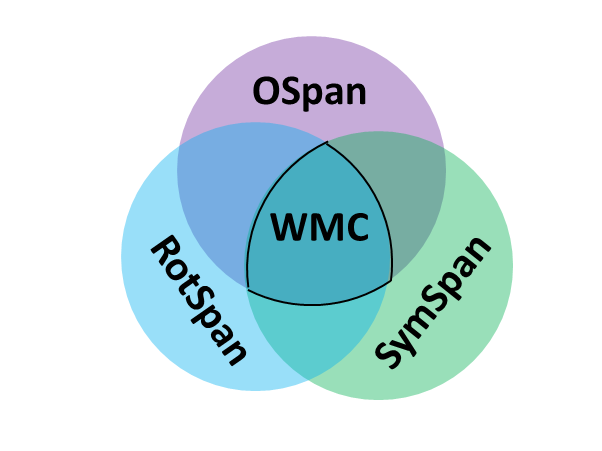
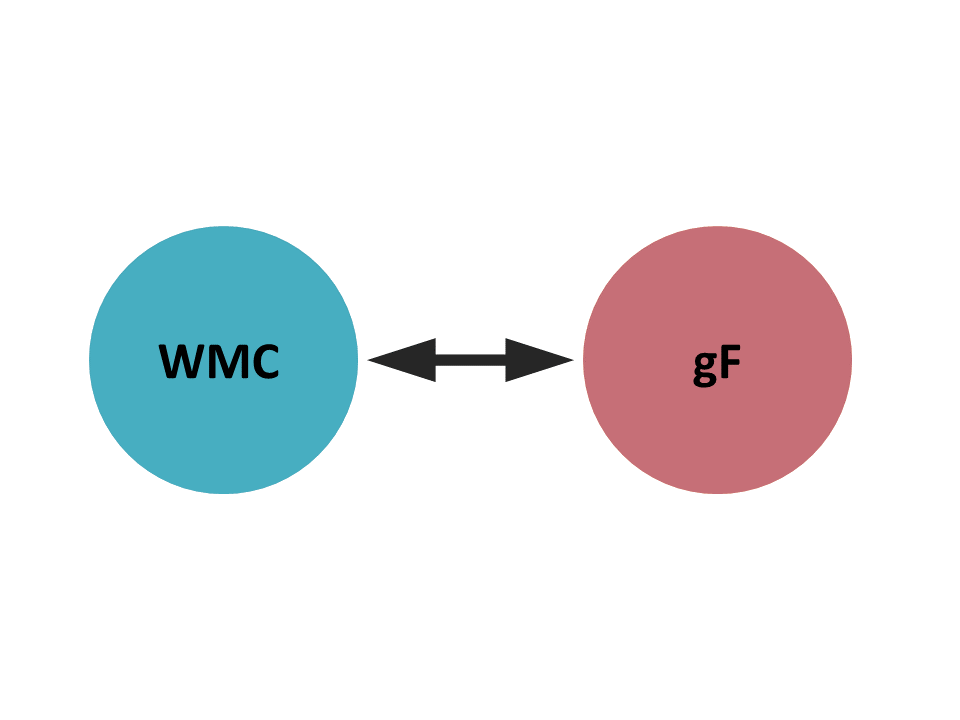
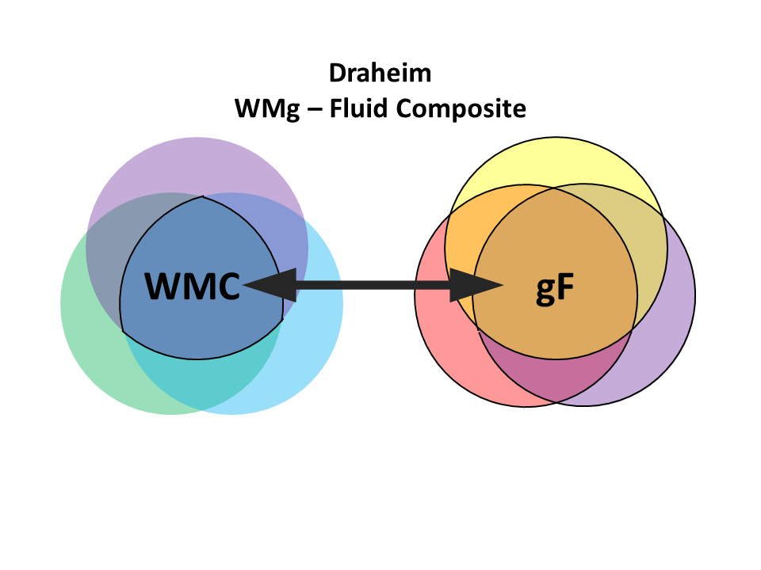
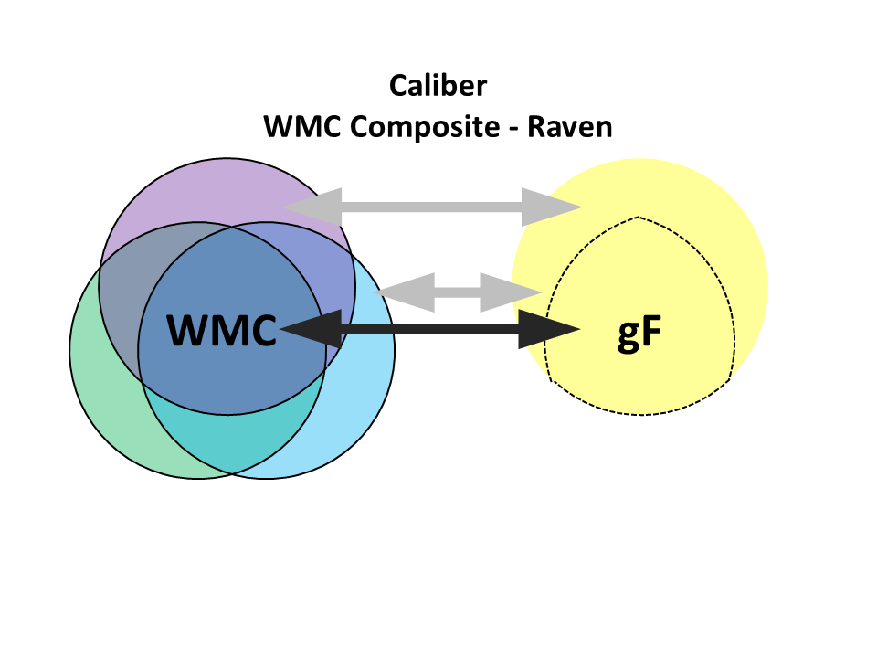

---
output:
  xaringan::moon_reader:
    seal: false
    lib_dir: libs
    nature:
      highlightStyle: github
      highlightLines: true
      countIncrementalSlides: false
      beforeInit: "macros.js"

---
class: inverse, left, middle

# A Song of Item Discrimination and Difficulty

## Multidimensional IRT on Complex Span Tasks

### `r Sys.Date()`

.large[
.right[
Han Hao, Ester Navarro Garcia, Kevin Rosales, & Andrew Conway
]
]

```{r setup, include=FALSE}
options(htmltools.dir.version = FALSE)

library(psych)
library(MASS)
library(lavaan)
library(semPlot)
library(DT)
library(readxl)
library(mirt)
library(tidyverse)
library(ggExtra)

```

```{r data, include = FALSE}

# Draheim et al. (2018) Study 1 Dataset, this is a subset with only the complete data of item-level SymSpan, item-level OSpan, and fluid Z scores.
Dra1R <- read_xlsx("C:/Users/henry/Google Drive/IRT/Dreheimetal/Dreheimetal_dataset.xlsx", sheet = 1)[-1,]

Dra <- Dra1R %>%
  dplyr::select(ZFluid = `Fluid Intelligence Z-score`, # Renaming and selecting standard fluid intelligence score
         OSpanPartial, SymSpanPartial, # Partial-Credit Load Totals for SymSpan and OSpan
         OS1.3 = OperationSpanBlock1SetSize3, OS1.4, OS1.5, OS1.6, OS1.7, OS2.3, OS2.4, OS2.5, OS2.6, OS2.7, OS3.3, OS3.4, OS3.5, OS3.6, OS3.7,
         SS1.2 = SymmetrySpanBlock1SetSize2, SS1.3, SS1.4, SS1.5, SS2.2, SS2.3, SS2.4, SS2.5, SS3.2, SS3.3, SS3.4, SS3.5
         
         # RS1.2 = RotationSpanBlock1SetSize2, RS1.3, RS1.4, RS1.5, RS2.2, RS2.3, RS2.4, RS2.5, RS3.2, RS3.3, RS3.4, RS3.5 # RSpan is not included in this analysis
         ) %>%
  # Scripts for Partial-Unit Load Totals transferation
  # mutate(SS1.2 = SS1.2/2, SS2.2 = SS2.2/2, SS3.2 = SS3.2/2,
  #        SS1.3 = SS1.3/3, SS2.3 = SS2.3/3, SS3.3 = SS3.3/3,
  #        SS1.4 = SS1.4/4, SS2.4 = SS2.4/4, SS3.4 = SS3.4/4,
  #        SS1.5 = SS1.5/5, SS2.5 = SS2.5/5, SS3.5 = SS3.5/5,
  #        OS1.3 = OS1.3/3, OS2.3 = OS2.3/3, OS3.3 = OS3.3/3,
  #        OS1.4 = OS1.4/4, OS2.4 = OS2.4/4, OS3.4 = OS3.4/4,
  #        OS1.5 = OS1.5/5, OS2.5 = OS2.5/5, OS3.5 = OS3.5/5,
  #        OS1.6 = OS1.6/6, OS2.6 = OS2.6/6, OS3.6 = OS3.6/6,
  #        OS1.7 = OS1.7/7, OS2.7 = OS2.7/7, OS3.7 = OS3.7/7) %>%
  drop_na()
Dra_matrix <- as.matrix(Dra)[,-c(1:3)] # mirt function only takes matrices

# Conway et al. (2019) Data
wmir <- read.csv("C:/Users/henry/Google Drive/IRT/WMIIRT/WMI_Read_Han_wide.csv")[,-1]
wmirot <- read.csv("C:/Users/henry/Google Drive/IRT/WMIIRT/WMI_Rot_Han_wide.csv")[,-1]
Raven <- read.csv("C:/Users/henry/Google Drive/IRT/WMIIRT/Ravensdata.csv") %>% 
  dplyr::select(Subject = ID, GF) # The Raven's Scores are now standardized.

# Wmi is the full dataset (N = 261)
Wmi <- merge(wmir, wmirot, by = "Subject") # No Ravens
Wmi$Rtotal <- as.vector(rowSums(Wmi[,c(2:16)]))
Wmi$Rottotal <- as.vector(rowSums(Wmi[,c(17:28)]))
Wmi_matrix <- as.matrix(Wmi)[,-c(29,30)] # Matrix with only the item-level RSpan and RotSpan with subject IDs

# WMI is a subset of Wmi with Ravens available (N = 100)
WMI <- merge(Wmi,Raven, by = "Subject") # With Ravens
WMI_matrix <- as.matrix(WMI)[,-c(29,30,31)] 

```

---
class: inverse, left, middle

# The Fantastic Complex Span Tasks
## and How to Interpret Them

---

background-image: url('https://media.springernature.com/full/springer-static/image/art%3A10.3758%2Fs13421-014-0461-7/MediaObjects/13421_2014_461_Fig1_HTML.gif')
background-position: 95% 50%
background-size: 40% 60%

## Working Memory Capacity

.pull-left[
Working memory is generally considered to have limited capacity and is of individual difference.

Working Memory Span tasks (Complex Span Tasks)
  + Reading Span (*Daneman & Carpenter, 1980*)
  + Operation Span (*Turner & Engle, 1989*)
  + Symmetry Span & Rotation Span (*Shah & Miyake, 1996*)
  
Storage and processing components

]

???

Working memory is an cognitive system with a limited capacity that is responsible for temporarily holding and processing information, and is considered to be important for a lot of, if not all, cognitive and intellectual activities.

---

## Working Memory Capacity As Executive Function

- High reliability and predictive validity to other WM tasks that require working memeory and cognitive control (*Oberauer et al., 2012*).

- WMC and fluid intelligence: WMC ~ STM, WMC ~ gF, ~~STM ~ gF~~ (*Engle, Tuholski, Laughlin, & Conway, 1999*)

- Performances on different types of C-Span tasks are all reflective to domain-general executive attention than to just domain-specific abilities (*Kane et al., 2004*)

- Performance on C-Span tasks reflects individual differences in cognitive control rather than mere retention of information (*Engle, 2002*)

---
class: inverse, left, middle

# Potential Issues in Practice

---

### No single C-Span task is domain-free or "process-pure"

*Shah & Miyake, 1996*: Spatial (verbal) C-Span tasks predict other spatial (verbal) performance better

> Use multiple C-Span tasks rather than a single task

.pull-left[

]

.pull-right[

]

**Parellel forms of C-Span tasks needed, time and resources are limited**

---

### Relative importance of domain-general vs. domain-specific abilities

Ability Differentiation (*Kovacs, Molenaar, & Conway, 2019*)

> Use latent factor models for better estimation of domain-general WMC

**Most latent factor models (CFA models) use task-level responses as manifest variables and still assume static reliability across items**

.center[

]

???
High-ability groups may exhibit more domain-specific variance, while for low-ability samples the variation in capacity will be more due to domain-general variance.

---

### Non-uniform reliability (across items & trait levels)

Uniform reliability across items and trait levels(scores) is assumed in classical test theory, but such assumption is less likely to hold in real practice.

> Use item response model for better item-level estimation

.pull-left[

- Theta: Latent construct

- Item Difficulty (threshold) Parameter (b/d): the point on the latent scale where a person has 50% chance of responding positively to an item

- Item Discrimination Parameter (a): the strength of an item's discrimination between people below or above the threshold, and the strength of association between the item and the trait measured by test

**IRT assumes unidimensionality.**
]

.pull-right[

]


---
class: inverse, left, middle

### CFA - accounts for task-level errors in multiple tasks;
### IRT - accounts for item-level errors in one task;
### Can we benefit from IRT and CFA at the same time?

--

### By Using...
# Multidimensional Item Response Theory

---

## Multidimentional IRT

- **MIRT ~ CFA estimated in logistic regressions**

  + latent factors ~ thetas; a parameters ~ factor loadings; b parameters ~ intercepts

- **Like CFA:**

  + properties of items and persons are both considered and included
  
  + local independence after controlling for latent trait
  
- **Unlike CFA:**

  + does not assume linear relationships/normally-distributed responses
  
  + No constant, nor normally-distributed errors
  
.center[
**MIRT can estimate CFA models under the benefits of IRT**
]

---

# What IRT Can Tell Us about C-Span Tasks

### Draheim et al. (2018)

- Overall difficulty of typical versions of some C-Span tasks (OSpan, SymSpan, & RotSpan) is not appropriate for discriminating subjects with average to high ability.

- The correlations to GF are stronger for items with highest discrimination. 

### However...
--

- a & b are both freely estimated across set sizes but **fixed across blocks**

  + fixed a parameters across blocks make theoretical sense, but fixed b parameters may not
  + Items could become easier across blocks per the prediction of strategy utilization, or become harder per the prediction of proactive interference.


---

# What IRT Can Tell Us about C-Span Tasks

**Draheim et al. (2018)**: Performance in all complex tasks (OSpan, SymSpan, & RotSpan) is not multidimentional (Only first eigenvalue being larger than 1.1)

--

.center[
```{r echo=FALSE, fig.height=6, fig.width=8, message=FALSE, warning=FALSE}
par(mar = c(4, 4, 1, .1))

# Parallel analysis for Draheim data OSpan and SymSpan
psych::fa.parallel(Dra[,-c(1:3)], fm = "ml", fa = "fa", error.bars = TRUE)
```
]

---

# Purpose

### Study 1: Unidimentional IRT models as an item-level investigation of four commmon complex span tasks.

Free estimation of difficulty (thresholds) across blocks (Is there any proactive interference or strategy using)

### Study 2: Multidimentional IRT models for an item/test level investigation on predictive validity of the tasks.

.large[
Apply a bi-factor structure (Domain-general WMg and Doamain-specific abilities) to subjects' item-level performance on multiple C-Span tasks with IRT estimation of item statistics and latent trait(s)
]

.large[
Compare the predictive validity to fluid intelligence between the latent WMg from MIRT and the convensional direct composite of WMC.
]

---
class: inverse, left, middle

## Datasets and Methods

.large[
- *Draheim et al. (2018)* Study 1 (OSpan & SymSpan, N = 567<sup>1</sup>) & *Conway et al. (2019)* Caliber-WMI (RSpan & RotSpan, N = 100<sup>2</sup>)

- CTT: WMC partial total scores by partial-credit load scoring (*Conway et al., 2005*)

- IRT: *mirt* Package in R, Generalized Partial Credit Model

  - Constrained item discriminations (**a**s) across blocks (Item reliability varies by set size but does not vary by block)

  - Constrained vs. Free estimation of item thresholds (**d**s) for all items
]

.footnote[
[1] Rotation Span data were not available for 2/3 of the subjects and therefore were not included.  
[2] A subgroup of 100 with Raven's matrices test performance available.

]

---

# Basic Statistics for Conventional WM Partial Scores

## Descriptives, Cronbach's Alpha Reliabilities, and Correlations between Verbal and Spatial Tasks for Both Datasets

```{r, echo = FALSE, warning = FALSE}
# Draheim et al. Descriptives Table
des.Dra <- as.data.frame(as.matrix(psych::describe(Dra[,c(2,3)]))[,c(2,3,4,11,12)])
des.Dra$alpha <- as.numeric(c(psych::alpha(Dra[,c(4:18)])$total[1],psych::alpha(Dra[,c(19:30)])$total[1]))
des.Dra$CorVS <- c(NA, cor(Dra$OSpanPartial, Dra$SymSpanPartial))
# Caliber Descriptives Table
des.Wmi <- as.data.frame(as.matrix(psych::describe(WMI[,c(29,30)]))[,c(2,3,4,11,12)])
des.Wmi$alpha <- as.numeric(c(psych::alpha(WMI[,c(2:16)])$total[1], psych::alpha(WMI[,c(17:28)])$total[1]))
des.Wmi$CorVS <- c(NA, cor(WMI$Rtotal, WMI$Rottotal))
# Together in kable function
des.table <- as.data.frame(rbind(des.Dra,des.Wmi), row.names = c("Draheim OSpan", "Draheim SymSpan", "Caliber RSpan", "Caliber RotSpan"))
des.table.2 <- round(des.table,2)
colnames(des.table.2) <- c("N", "Mean", "SD", "Skew", "Kurtosis", "Alpha", "r")
knitr::kable(des.table.2, format = 'html',table.attr = "style = 'width: 90%;'")

```

---
class: inverse

## Conventional WM Partial Scores Viz

.pull-left[
### Draheim
```{r, echo = FALSE}

DraOSym <- ggMarginal(ggplot(Dra, aes(x=SymSpanPartial/42, y=OSpanPartial/75)) +
      geom_point() + xlim(0,1) + ylim(0,1) + xlab("Symmetry Span Partial") + ylab("Operation Span Partial") +
      theme(legend.position="none", axis.title.x = element_text(size = 20，face = "bold"), axis.title.y = element_text(size = 20，face = "bold")), type="histogram")

DraOSym

```
]

.pull-right[
### Caliber
```{r, echo = FALSE}

WmiRRot <- ggMarginal(ggplot(WMI, aes(x=Rottotal/42, y=Rtotal/75)) +
      geom_point() + xlim(0,1) + ylim(0,1) + xlab("Rotation Span Partial") + ylab("Reading Span Partial") +
      theme(legend.position="none", axis.title.x = element_text(size = 20，face = "bold"), axis.title.y = element_text(size = 20，face = "bold")), type="histogram")

WmiRRot

```
]

---
# Study 1: Unidimensional IRT Models

```{r unimodels, message=FALSE, include=FALSE}

# Uni-dimensional Models
# Dra = Draheim, WMI = Caliber
# Sym = SymSpan, Ope = OSpan, Rot = RotSpan, Rea = RSpan
# "Model"s fix only a parameters across blocks
# "Model2"s fix a and d parameters across blocks

Dra_Sym_Model <- mirt.model("
                           SYMSPAN = 1 - 12
                           CONSTRAIN = (1,5,9,a1), (2,6,10,a1),(3,7,11,a1),(4,8,12,a1)")


Dra_Ope_Model <- mirt.model("
                           OSPAN = 1 - 15
                           CONSTRAIN = (1,6,11,a1),(2,7,12,a1),(3,8,13,a1),(4,9,14,a1),(5,10,15,a1) ")

WMI_Rea_Model <- mirt.model("
                           RSPAN = 1 - 15
                           CONSTRAIN = (1,6,11,a1),(2,7,12,a1),(3,8,13,a1),(4,9,14,a1),(5,10,15,a1)")


WMI_Rot_Model <- mirt.model("
                           ROTSPAN = 1 - 12
                           CONSTRAIN = (1,5,9,a1), (2,6,10,a1),(3,7,11,a1),(4,8,12,a1)")

Dra_Sym_Model2 <- mirt.model("
                           SYMSPAN = 1 - 12
                           CONSTRAIN = (1,5,9,a1), (2,6,10,a1),(3,7,11,a1),(4,8,12,a1),(1,5,9,d1), (2,6,10,d1),(3,7,11,d1),(4,8,12,d1),(1,5,9,d2), (2,6,10,d2),(3,7,11,d2),(4,8,12,d2), (2,6,10,d3),(3,7,11,d3),(4,8,12,d3),(3,7,11,d4),(4,8,12,d4),(4,8,12,d5)")


Dra_Ope_Model2 <- mirt.model("
                           OSPAN = 1 - 15
                           CONSTRAIN = (1,6,11,a1),(2,7,12,a1),(3,8,13,a1),(4,9,14,a1),(5,10,15,a1),(1,6,11,d1),(2,7,12,d1),(3,8,13,d1),(4,9,14,d1),(5,10,15,d1),(1,6,11,d2),(2,7,12,d2),(3,8,13,d2),(4,9,14,d2),(5,10,15,d2),(1,6,11,d3),(2,7,12,d3),(3,8,13,d3),(4,9,14,d3),(5,10,15,d3),(2,7,12,d4),(3,8,13,d4),(4,9,14,d4),(5,10,15,d4),(3,8,13,d5),(4,9,14,d5),(5,10,15,d5),(4,9,14,d6),(5,10,15,d6),(5,10,15,d7) ")


WMI_Rea_Model2 <- mirt.model("
                           RSPAN = 1 - 15
                           CONSTRAIN = (1,6,11,a1),(2,7,12,a1),(3,8,13,a1),(4,9,14,a1),(5,10,15,a1),(1,6,11,d1),(2,7,12,d1),(3,8,13,d1),(4,9,14,d1),(5,10,15,d1),(1,6,11,d2),(2,7,12,d2),(3,8,13,d2),(4,9,14,d2),(5,10,15,d2),(1,6,11,d3),(2,7,12,d3),(3,8,13,d3),(4,9,14,d3),(5,10,15,d3),(2,7,12,d4),(3,8,13,d4),(4,9,14,d4),(5,10,15,d4),(3,8,13,d5),(4,9,14,d5),(5,10,15,d5),(4,9,14,d6),(5,10,15,d6),(5,10,15,d7)")


WMI_Rot_Model2 <- mirt.model("
                           ROTSPAN = 1 - 12
                           CONSTRAIN = (1,5,9,a1), (2,6,10,a1),(3,7,11,a1),(4,8,12,a1),(1,5,9,d1), (2,6,10,d1),(3,7,11,d1),(4,8,12,d1),(1,5,9,d2), (2,6,10,d2),(3,7,11,d2),(4,8,12,d2), (2,6,10,d3),(3,7,11,d3),(4,8,12,d3),(3,7,11,d4),(4,8,12,d4),(4,8,12,d5)")

```


```{r uniestimations, message=FALSE, include=FALSE}
# Model 1Dra_Sym_Model
Dra_Sym_GPCM <- mirt::mirt(Dra_matrix[,16:27], Dra_Sym_Model, itemtype = "gpcm", SE = TRUE)
Dra_Sym_GPCM2 <- mirt::mirt(Dra_matrix[,16:27], Dra_Sym_Model2, itemtype = "gpcm", SE = TRUE)
# Coefficients
Dra_Sym_Coef <- coef(Dra_Sym_GPCM,simplify = TRUE)


# Model 2Dra_Ope_Model
Dra_Ope_GPCM <- mirt::mirt(Dra_matrix[,1:15], Dra_Ope_Model, itemtype = "gpcm", SE = TRUE)
Dra_Ope_GPCM2 <- mirt::mirt(Dra_matrix[,1:15], Dra_Ope_Model2, itemtype = "gpcm", SE = TRUE)
# Coefficients
Dra_Ope_Coef <- coef(Dra_Ope_GPCM,simplify = TRUE)


# Model 1WMI_Rea_Model
WMI_Rea_GPCM <- mirt::mirt(WMI_matrix[,2:16], WMI_Rea_Model, itemtype = "gpcm", SE = TRUE)
WMI_Rea_GPCM2 <- mirt::mirt(WMI_matrix[,2:16], WMI_Rea_Model2, itemtype = "gpcm", SE = TRUE)
# Coefficients
WMI_Rea_Coef <- coef(WMI_Rea_GPCM,simplify = TRUE)

# Model 2WMI_Rot_Model
WMI_Rot_GPCM <- mirt::mirt(WMI_matrix[, 17:28], WMI_Rot_Model, itemtype = "gpcm", SE = TRUE)
WMI_Rot_GPCM2 <- mirt::mirt(WMI_matrix[, 17:28], WMI_Rot_Model2, itemtype = "gpcm", SE = TRUE)
# Coefficients
WMI_Rot_Coef <- coef(WMI_Rot_GPCM,simplify = TRUE)


```

```{r unicomparisons, message=FALSE, include=FALSE}

# Model Comparison Results
comp1 <-anova(Dra_Ope_GPCM2,Dra_Ope_GPCM)
comp2 <-anova(Dra_Sym_GPCM2,Dra_Sym_GPCM)
comp3 <-anova(WMI_Rea_GPCM2,WMI_Rea_GPCM)
comp4 <-anova(WMI_Rot_GPCM2,WMI_Rot_GPCM)
comp <- rbind(comp1,comp2,comp3,comp4)

# Formating for kable
comp <- cbind(round(comp[,-c(8:9)],2), round(comp[,7],2),comp[,8],round(comp[,9],3))
comp[c(1,3,5,7),7:9] <- " "
comp[2,9] <- "<.001"

# I tried to use greek letters in the column labels but failed. Please feel free to take it from here.
# unit<-"beta" 
# txt <- paste0("expression(",unit,"~'/ml')")
# ylab<-eval(parse(text=txt))
```

```{r unicomparisonTable, echo=FALSE, message=FALSE}
# kable presents the table of comparisons
UniComparisons <- as.data.frame(comp[,c(1,5:9)], row.names = c("OSpan Fix", "OSpan Free","SymSpan Fix", "SymSpan Free","RSpan Fix", "RSpan Free","RotSpan Fix", "RotSpan Free"))
knitr::kable(UniComparisons, col.names = c("AIC", "BIC","LogLik", "Chi", "df", "p"), caption = "Model Comparisons between Models with Fixed ds and Models with Free ds across Blocks", format = 'html',table.attr = "style = 'width: 90%;'")
```

- For OSpan task, free-d model is significantly better than the fix-d model (All items get easier by block)

- For the other three tasks, free estimation of ds does not significantly improve model fits (Short items get harder while long items get easier)

---

## Study 1 Takeaways

.pull-left[
According to information curves, all four tasks are relatively easy and more reliable for low-to-average ability subjects: all four tasks have their highest info (lowest error) below theta = 0

For Ospan task, all items are easier in Block 3 than in Block 1: Strategy Using

For the other 3 tasks, there is a stable trend in every task: short items get more difficult across blocks while long items get easier: Dual-influence of Proactive interference vs. Strategy Using (Practicing)

]

.pull-right[
```{r, echo = FALSE}
# par(mar = c(4, 4, 1, .1))
# Test information curve with SE curve
plot(Dra_Ope_GPCM, type = "infoSE", theta_lim = c(-4,4), par.settings = list(cex = 12), main = "Test Info and SEs for OSpan")
```
]

???

Later gets worse = Proactive interference
Later gets better = Practicing effect/Strategy Using

---
## Study 1: Item Traces Example (OSpan)

```{r, echo = FALSE, fig.width = 12, fig.height= 7}
# par(mar = c(4, 4, 1, .1))
# Item tracelinse presents the probilities of getting  a specific score in one item as a function of the latent trait
plot(Dra_Ope_GPCM, type = "trace", theta_lim = c(-4,4), par.settings = list(cex = 12), main = "Item Tracelines for OSpan", auto.key = list(space = "null"))
```

---
## Study 1: Item Scoring Example (OSpan)

```{r, echo = FALSE, fig.width = 12, fig.height= 7}
# par(mar = c(4, 4, 1, .1))
# Item tracelinse presents the expected score in one item as a function of the latent trait
plot(Dra_Ope_GPCM, type = "itemscore", theta_lim = c(-4,4), par.settings = list(cex = 12), main = "Item Scoring curves for OSpan")
```


---

# Study 2: MIRT Bi-Factor Models

### Purpose: Multidimentional IRT models for an item/test level investigation on predictive validity of the tasks.

.large[
Apply a bi-factor structure (Domain-general WMg and Doamain-specific abilities) to subjects' item-level performance on multiple C-Span tasks with IRT item statistics and latent trait(s) estimates

Compare the predictive validity to fluid intelligence between the latent WMg from MIRT and the convensional direct composite of WMC.
]

---

## Study 2: MIRT Bi-Factor Models

.center[
Predictive Validity of WMC to Fluid Intelligence


]

---

## Study 2: MIRT Bi-Factor Models

.center[
Predictive Validity of WMC to Fluid Intelligence


]

---
## Study 2: MIRT Bi-Factor Models

.pull-left[
Acknowledging the general ability C-Span tasks measure and the multi-dimensional structure of C-Span responses at the same time.

  - Constrained item discriminations (**a**s) across blocks
  - Free estimation of item thresholds (**d**s) for all items
]

.pull-right[

]


```{r bimodelestimations, message=FALSE, include=FALSE}
# The 2nd tier bi-factor model specification, a parameters are fixed for the general factor (a1) and for the specific factors (a2 & a3)
genModel <- mirt.model("
                          WMg = 1 - 27
                          CONSTRAIN = (1,6,11,a1), (2,7,12,a1),(3,8,13,a1),(4,9,14,a1),(5,10,15,a1),(16,20,24,a1),(17,21,25,a1),(18,22,26,a1),(19,23,27,a1),(1,6,11,a2), (2,7,12,a2),(3,8,13,a2),(4,9,14,a2),(5,10,15,a2),(16,20,24,a3),(17,21,25,a3),(18,22,26,a3),(19,23,27,a3)
                       ")
# Bi-factor fitting: the first argument reads in the dataset, the 2nd specify the items that belong to corresponding specific factors, the third one reads in the previous model specification in which parameters can be fixed
Dra.bmodel <- bfactor(Dra_matrix, c(rep(1,15),rep(2,12)),model2 = genModel, itemtype = "gpcm", SE = TRUE)
# Saving factor loadings
Dra.fl<-summary(Dra.bmodel)$rotF[,1:3]

Wmi.bmodel <- bfactor(WMI_matrix[,-1], c(rep(1,15),rep(2,12)),model2 = genModel, itemtype = "gpcm", SE = TRUE)
Wmi.fl<-summary(Wmi.bmodel)$rotF[,1:3]

# Formating final correlation matrix for the correlation plot
Dra.bi.fs <- as.data.frame(fscores(Dra.bmodel))
Dra.scores <- cbind(Dra.bi.fs, Dra$ZFluid)
colnames(Dra.scores) <- c("WMG", "OS", "SymS", "ZFluid")
Dra.scores$`OC` <- Dra$OSpanPartial
Dra.scores$`SymC` <- Dra$SymSpanPartial
#Dra.scores$`WMC Composite` <- (Dra$OSpanPartial/75 + Dra$SymSpanPartial/42)/2
Dra.scores$`WMC` <- (scale(Dra$OSpanPartial) + scale(Dra$SymSpanPartial))/2
Dra.scores$`Uni O` <- as.vector(fscores(Dra_Ope_GPCM))
Dra.scores$`Uni Sym` <- as.vector(fscores(Dra_Sym_GPCM))
Dra.scores$`Uni Composite` <- (Dra.scores$`Uni O` + Dra.scores$`Uni Sym`)/2
Dra.r <- cor(Dra.scores[,c(4,7,5,6,1,2,3)]) #10,8,9,
Dra.p <- corrplot::cor.mtest(Dra.scores[,c(4,7,5,6,1,2,3)])#10,8,9,

Wmi.bi.fs <- as.data.frame(fscores(Wmi.bmodel))
Wmi.bi.fs$Subject <- WMI$Subject
Wmi.scores <- merge(Wmi.bi.fs, Raven, by = "Subject", all = TRUE)
Wmi.scores <- Wmi.scores[Wmi.scores$Subject != 75,]
colnames(Wmi.scores) <- c("Subject","WMG", "RS", "RotS", "ZRaven")
Wmi.scores$`RC` <- WMI$Rtotal
Wmi.scores$`RotC` <- WMI$Rottotal
#Wmi.scores$`WMC Composite` <- (WMI$Rtotal/75 + WMI$Rottotal/42)/2
Wmi.scores$`WMC` <- (scale(WMI$Rtotal) + scale(WMI$Rottotal))/2
Wmi.scores$`Uni R` <- as.vector(fscores(WMI_Rea_GPCM))
Wmi.scores$`Uni Rot` <- as.vector(fscores(WMI_Rot_GPCM))
Wmi.scores$`Uni Composite` <- (Wmi.scores$`Uni R` + Wmi.scores$`Uni Rot`)/2
Wmi.scores <- Wmi.scores[,-1]
Wmi.r <- cor(Wmi.scores[,c(4,7,5,6,1,2,3)]) # 10,8,9,
Wmi.p <- corrplot::cor.mtest(Wmi.scores[,c(4,7,5,6,1,2,3)])#10,8,9,
```

---

## Model Fits and Coefficients

```{r, echo = FALSE, warning = FALSE}

modelfit <- as.data.frame(round(rbind(M2(Dra.bmodel), M2(Wmi.bmodel)),2), row.names = c("Draheim", "Caliber"))

knitr::kable(modelfit, caption = "Model Fits for the two Bi-factor Models", format = 'html',table.attr = "style = 'width: 90%;'")

```

--
.pull-left[
```{r echo=FALSE}
# Factor loadings
knitr::kable(round(Dra.fl[c(1:5,16:19),],2), col.names = c("WMg", "Os", "SYMs"), caption = "OSpan & SymSpan", format = 'html',table.attr = "style = 'width: 90%;'")
```


]
.pull-right[
```{r echo=FALSE}
# Factor loadings again
knitr::kable(round(Wmi.fl[c(1:5,16:19),],2), col.names = c("WMg", "Rs", "ROTs"), caption = "RSpan & RotSpan", format = 'html',table.attr = "style = 'width: 90%;'")
```

]


---
### Correlation Tables of Fluid Task Performance, CTT Scores, Uni-IRT Scores, and Bi-IRT Scores (Draheim Data)

.left-column[
Williams' test for dependent correlations:
*t*(564) = 1.02, *p* = .310
]

.right-column[
```{r echo=FALSE}
#par(mar = c(4, 4, 4, 4))
corrplot::corrplot.mixed(Dra.r, p.mat = Dra.p$p, lower = "number", upper = "shade", sig.level = .05, insig = "pch", tl.pos = "lt", tl.col = "black", tl.srt = 0)

```
]


---

### Correlation Tables of Fluid Task Performance, CTT Scores, Uni-IRT Scores, and Bi-IRT Scores (Caliber Data)

.left-column[

Williams' test for dependent correlations:
*t*(97) = 3.27, *p* = .002
]

.right-column[
```{r echo=FALSE}
#par(mar = c(4, 4, 1, .1))
corrplot::corrplot.mixed(Wmi.r, p.mat = Wmi.p$p, lower = "number", upper = "shade", sig.level = .05, insig = "pch", tl.pos = "lt", tl.col = "black", tl.srt = 0)
```
]

---

## Potential Interpretation

.center[

]

---

## Potential Interpretation

.center[

]

---

## Potential Interpretation

.center[

]

---

## Potential Interpretation

.center[

]


---

## Study2 Takeaways

### MIRT may provide better estimations of true WMC that is different from CTT by considering item-level and task-level errors for different samples.

### More and better measures are always recommended when measuring indirect traits if possible; otherwise, taking IRT/CFA approaches at the item level may provide more appropriate estimation of the latent traits.

### C-Span tasks are not "domain-free", but different C-Span tasks may exhibit domain-general/domain-specific domination differently. Larger scale data (more tasks and larger N) are needed for any further claim.

---

# Future Directions

### Confirm the current results with more tasks and larger Ns

### Compare the item-level MIRT estimation and task-level CFA estimation

### Compare different item scoring approaches (total vs. partial)

### Increasing the general difficulty of the C-Span Tasks

### Adaptive testing of WMC (?)

---

class: center, middle

# Thanks!

Slides created via the R package [**xaringan**](https://github.com/yihui/xaringan).  
Scripts and files are available at my [**github page**](https://github.com/HanSingle/HanSingle.github.io/).

---

```{r eval=FALSE, include=FALSE}


biModel <- mirt.model("
                           RSPAN = 1 - 15
                           ROTSPAN = 16 - 27
                           CONSTRAIN = 
                           ")
genModel <- mirt.model("
                          WMg = 1 - 27
                          CONSTRAIN = (1,6,11,a1), (2,7,12,a1),(3,8,13,a1),(4,9,14,a1),(5,10,15,a1),(16,20,24,a1),(17,21,25,a1),(18,22,26,a1),(19,23,27,a1),(1,6,11,a2), (2,7,12,a2),(3,8,13,a2),(4,9,14,a2),(5,10,15,a2),(16,20,24,a3),(17,21,25,a3),(18,22,26,a3),(19,23,27,a3)
                       ")

bmodel1 <- bfactor(Wmi_matrix[,-1], c(rep(1,15),rep(2,12)), itemtype = "gpcm", SE = TRUE)
bmodel2 <- bfactor(Wmi_matrix[,-1], c(rep(1,15),rep(2,12)), model2 = genModel, itemtype = "gpcm", SE = TRUE)
coef(bmodel2,simplify = TRUE)
summary(bmodel2)


#WMg =~  R1_3 + R2_3 + R3_3 + R1_4 + R2_4 + R3_4 + R1_5 + R2_5 + R3_5 + R1_6 + R2_6 + R3_6 + R1_7 + R2_7 + R3_7 + Rot1_2 + Rot2_2 + Rot3_2 +Rot1_3 + Rot2_3 + Rot3_3 + Rot1_4 + Rot2_4 + Rot3_4 + Rot1_5 + Rot2_5 + Rot3_5
factor.model <- ' R =~ R1_3 + R2_3 + R3_3 + R1_4 + R2_4 + R3_4 + R1_5 + R2_5 + R3_5 + R1_6 + R2_6 + R3_6 + R1_7 + R2_7 + R3_7 
                  Rot =~ Rot1_2 + Rot2_2 + Rot3_2 +Rot1_3 + Rot2_3 + Rot3_3 + Rot1_4 + Rot2_4 + Rot3_4 + Rot1_5 + Rot2_5 + Rot3_5
                   WMC =~ R1_3 + R2_3 + R3_3 + R1_4 + R2_4 + R3_4 + R1_5 + R2_5 + R3_5 + R1_6 + R2_6 + R3_6 + R1_7 + R2_7 + R3_7 + Rot1_2 + Rot2_2 + Rot3_2 +Rot1_3 + Rot2_3 + Rot3_3 + Rot1_4 + Rot2_4 + Rot3_4 + Rot1_5 + Rot2_5 + Rot3_5
'
cfactor <- sem(factor.model, Wmi)
summary(cfactor, standardized = TRUE)


```


---

## Dataset 1: Draheim et al. (2018)

- N = 567

- SymSpan (12 items, set sizes 2 - 5), OSpan (15 items, set sizes 3 - 7), ~~RotSpan~~

- Fluid Z Score (test descriptions not available)

- Constraining a parameters across blocks for items with same set sizes

---

### SymSpan Item Scoring Tracelines

```{r echo=FALSE}
par(mar = c(4, 4, 1, .1))
plot(Dra_Sym_GPCM, type = "itemscore", theta_lim = c(-4,4), par.settings = list(cex = 12))
```


---

### SymSpan Item Probability Tracelines


```{r echo=FALSE}
par(mar = c(4, 4, 1, .1))
plot(Dra_Sym_GPCM, type = "trace", theta_lim = c(-4,4), par.settings = list(cex = 12))
```


---

### SymSpan Task Overall


```{r, echo = FALSE}
par(mar = c(4, 4, 1, .1))
plot(Dra_Sym_GPCM, type = "infoSE", theta_lim = c(-4,4), par.settings = list(cex = 12))
```


---

### OSpan Item Scoring Tracelines

```{r, echo = FALSE}
par(mar = c(4, 4, 1, .1))
plot(Dra_Ope_GPCM, type = "itemscore", theta_lim = c(-4,4), par.settings = list(cex = 12))
```


---

### OSpan Item Probability Tracelines

```{r, echo = FALSE}
par(mar = c(4, 4, 1, .1))
plot(Dra_Ope_GPCM, type = "trace", theta_lim = c(-4,4), par.settings = list(cex = 12))
```


---

### OSpan Task Overall

```{r, echo = FALSE}
par(mar = c(4, 4, 1, .1))
plot(Dra_Ope_GPCM, type = "infoSE", theta_lim = c(-4,4), par.settings = list(cex = 12))
```


---

## Dataset 2: Conway et al. (2019)

- N = 261
- RSpan (15 items, set sizes 3 - 7), RotSpan (12 items, set sizes 2 - 5)
- N' = 100, Standard scores on Raven's
- Constraining a parameters across blocks for items with same set sizes

---

### RotSpan Item Scoring Tracelines

```{r, echo = FALSE}
par(mar = c(4, 4, 1, .1))
plot(WMI_Rot_GPCM, type = "itemscore",theta_lim = c(-4,4), par.settings = list(cex = 12))
```

---

### RotSpan Item Probability Tracelines

```{r, echo = FALSE}
par(mar = c(4, 4, 1, .1))
plot(WMI_Rot_GPCM, type = "trace",theta_lim = c(-4,4), par.settings = list(cex = 12))
```

---

### RSpan Item Scoring Tracelines

```{r, echo = FALSE}
par(mar = c(4, 4, 1, .1))
plot(WMI_Rea_GPCM, type = "itemscore",theta_lim = c(-4,4), par.settings = list(cex = 12))
```

---

### RSpan Item Probability Tracelines

```{r, echo = FALSE}
par(mar = c(4, 4, 1, .1))
plot(WMI_Rea_GPCM, type = "trace",theta_lim = c(-4,4), par.settings = list(cex = 12))
```

---

## CTT vs. IRT

.pull-left[

- Constant measurement error (reliability)

- Assumes normally distributed, continuous item responses

+ Parallel tests needed for comparing across forms

+ assuming representitive sample (more sample-dependent)

+ More meaningful at task level

]

.pull-right[

- Varing measurement error on trait level

- Relatively flexible in item types

- Comparison across test forms is optimal

- rely less on representativity of sample

- Allows more item-level investigations

]

---