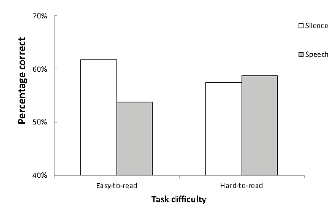
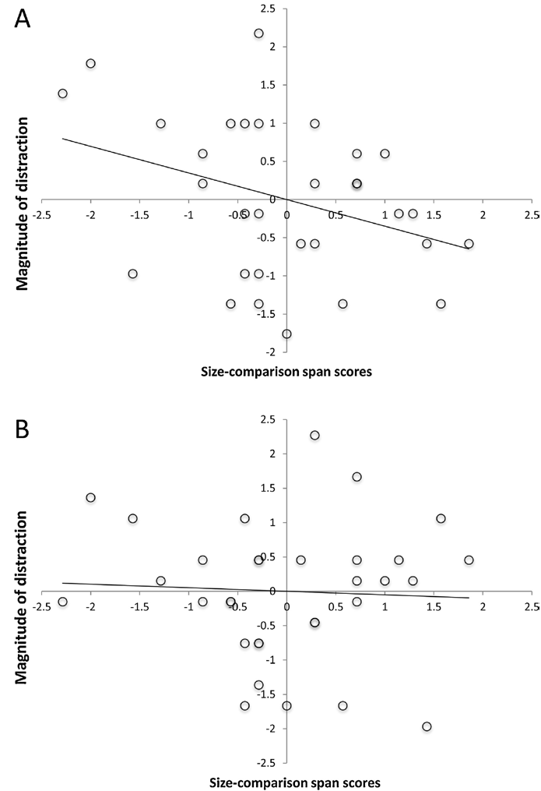

```{r}
library(tidyverse)
library(here)
library(hrbrthemes)
library(patchwork)
library(gridExtra)
library(png)
library(plyr)
library(cowplot)
library(knitr)
library(Rmisc)
library(reshape2)
library(magick)
```

## Header row {data-height=14}

###

<table style="width:100%">
<tr>
  <td rowspan="3">
  </img>
  </td>
  <td><center><h3>
  **The Impact of Auditory Distraction on Reading Comprehension</br> An Individual Differences Investigation**
  </h3></center></td>
  <td rowspan="3">
  </img>
  </td>
</tr>
<tr><td><center>
  **Han Hao** &nbsp;
  **&amp;** &nbsp;
  **Andrew R. A. Conway** &nbsp;
  *Claremont Graduate University* &nbsp;
  </center></td>
</tr>
<tr><td><center>
  **Han Hao** &nbsp;
  <i class="fas fa-envelope"></i> han.hao\@cgu.edu &nbsp;
  <i class="fas fa-globe"></i> <a href="https://osf.io/3ug4k" style="text-decoration:none;">osf.io/3ug4k</a> &nbsp;
  <i class="fab fa-github"></i> <a href="https://github.com/hansingle" style="text-decoration:none;">github.com/hansingle</a>
  </center></td>
</tr>
</table> 

<hr>

<!--
**Abstract** This paragraph will be rendered inside a wide box right below the
poster title and authors information.
The `render_print` format option is set to `TRUE` by default in this poster
sample, and will result in `postr::render` being called when knitting the
document (see `help("flex_dashboard_poster", package = postr)`).
To disable this (recommended in the initial stages of poster development)
set the `render_print` option to `FALSE`.
-->


## Body row {data-height=75}

### **Introduction** {data-width=400, .small}

#### Research Question

 **Does auditory distraction impair reading comprehension performance across different settings?**

#### Motivation

**The Disfluency Effect**: Perceptually difficult task may improve performance (e.g. hard-to-read font)   
**The Shield Effect**: Disfluency manipulation can shield attention from being impaired by distraction  
**Individual Differences**: Working memory capacity, attention, and reading comprehension      
    
#### The Present Study
A replication and extension of Halin et al. (2014) on the shield effect in reading comprehension  
Investigation of the effect of auditory distraction, perceptual difficulty, and working memory capacity on reading task performance  

### **Halin et al. (2014) &nbsp; &nbsp; &nbsp; &nbsp; &nbsp; &nbsp; &nbsp; &nbsp; &nbsp; &nbsp; &nbsp; &nbsp; &nbsp; &nbsp; &nbsp; &nbsp; &nbsp; &nbsp; &nbsp; &nbsp;The Present study** {data-width=800}

```{r, eval = TRUE, fig.width=7.5, dpi=300}

#Group.H <- 
#Group.H <- 

DAT3 <- read.csv("C:/Users/henry/OneDrive - Claremont Graduate University/Thesis/Data/Experiment Data/Data.csv")
DAT1 <- read.csv("C:/Users/henry/OneDrive - Claremont Graduate University/Thesis/Data/Experiment Data/SpeedData.csv")

DAT3$Distraction <- as.factor(DAT3$Distraction)
DAT3$ID <- as.factor(DAT3$ID)


DAT1Clean <- DAT1[which(DAT1$Speed < 200),]
DAT1Clean <- DAT1Clean[-which(DAT1Clean$ID %in% c(1,3,13,44,59,73,81,107,128,136,163,172,175,180,219,220,235)),]
DAT3Clean <- DAT3[which(DAT3$ID %in% DAT1Clean$ID),]

DAT3Clean$Font <- revalue(DAT3Clean$Font, c("Haettenschweiler" = "Hard-to-read","Times New Roman" = "Easy-to-read"))
DAT3Clean$Distraction <- revalue(DAT3Clean$Distraction, c("3" = "No Noise", "2" = "Meaningless", "1" = "Speech"))

DescribeSummary <- summarySE(DAT3Clean, measurevar = "Score", groupvars = c("Font","Distraction"))


Group.P <-  DescribeSummary %>%
  mutate(Font = fct_relevel(Font, "Easy-to-read","Hard-to-read")) %>%
mutate(Distraction = fct_relevel(Distraction, "No Noise","Meaningless","Speech")) %>%
  ggplot(aes(x=Font, y=Score, fill=Distraction)) + 
  geom_errorbar(aes(ymin=Score-se, 
                    ymax=Score+se), 
                width=.2, size=1, position=position_dodge(0.9)) +
  geom_bar(position = "dodge2", stat = "identity", alpha = 0.5) +
  coord_cartesian(ylim=c(6,9))+
  theme_bw() +
  theme(
    axis.title.y = element_text(vjust= 1.8),
    axis.title.x = element_text(vjust= -0.5),
    axis.title = element_text(face = "bold"))+
  labs(title = expression(paste("Sig. Effect of Distraction, ", eta[p]^{2} ," = .05")))

DAT3Wide1 <- dcast(DAT3Clean,ID + Font ~ Distraction, value.var = "Score")

DAT <- merge(DAT3Wide1,DAT1Clean[,-2],by="ID")
DAT$Dist <- DAT$"No Noise" - DAT$Speech
DAT$WMC <- DAT$RSpan/75 + DAT$RotSpan/42

F1 <- subset(DAT, Font == "Easy-to-read")
F2 <- subset(DAT, Font == "Hard-to-read")

L1<-lm(Dist~WMC,data = F1)
L2<-lm(Dist~WMC,data = F2)


P1 <- ggplot(L1$model, aes_string(x = names(L1$model)[2], y = names(L1$model)[1])) + 
  geom_point() +
  stat_smooth(method = "lm", col = "red", size = 2, alpha = 0.3) +
  labs(title = "Easy-to-read",
                     x = "Working Memory Capacity",
                     y = "Distraction Effect")

P2 <- ggplot(L1$model, aes_string(x = names(L1$model)[2], y = names(L1$model)[1])) + 
  geom_point() +
  stat_smooth(method = "lm", col = "red", size = 2, alpha = 0.3) +
  labs(title = "Hard-to-read",
       x = "Working Memory Capacity",
       y = "Distraction Effect")


ggdraw() +
  draw_image("Group Effects.png",0,0.65,0.5,0.35) +
  draw_image("Individual Effects.png",0, 0, 0.5,0.65) +
  draw_plot(Group.P, 0.5, 0.65, 0.5,0.35) +
  draw_plot(P1,0.5,0.32, 0.5,0.32) +
  draw_plot(P2,0.5,0,0.5,0.32)
```


### **Method** {data-width=400, .small}

#### Design & Participants

2 by 3 Mixed Factorial, N = 33 + 40    
Font: <span style="font-family:Times New Roman;font-size:1.2em;">Easy-to-read</span> vs. <span style="font-family:Haettenschweiler;font-size:1.2em;">Hard-to-read</span>  
Distraction: **No noise / Meaningless / Speech**  

#### Procedure & Materials

**WMC Tasks**: Reading span & rotation span  
**Reading Tests**: 3 reading tests with 3 levels of distraction  
**Manipulation Checks**: Reading speed and subjective perception of difficulty

#### Results
No difference in reading speed between two fonts  
Reading with no distraction was perceived to be easier  
**Group Level**: Main effect of distraction, no main effect of font, and no interaction between font and distraction  
**Individual Level**: No correlation between WMC and distraction effect, no moderation of font  

## Footer row {data-height=15} 

### **Conclusion** {data-width=45}

Halin et al. (2014) not replicated: Perceptual difficulty did not shield task performance from being impaired by auditory distraction.  
Overall, task performance is impaired when a background noise exists.  
The shield effect of disfluency on reading tasks is not reliable.  

### **Future Research** {data-width=45}
More questions for each reading test  
Larger sample size  
Recall/recognition questions vs. comprehension questions  
Memory performance on the distractor speech  

<!-- ### The Caliber Lab \@ CGU {data-width=15, .small} -->

<!-- <small> -->
<!--   </img> -->
<!-- </small> -->


<!-- 
postr::render("C:/Users/henry/OneDrive - Claremont Graduate University/Thesis/WPA2019Poster/HanHaoCGU_WPA_2019.html", aspect_ratio = 3/4)
-->